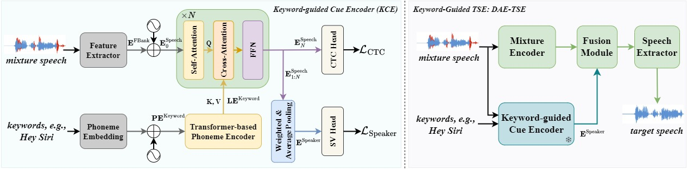

# DAE-TSE: Detect, Attend and Extract — Keyword Guided Target Speaker Extraction

<p align="center">
  <a href="https://arxiv.org/abs/2602.07977"></a>
  <a href="https://huggingface.co/GnafiY/DAE-TSE"></a>
  <a href="https://gnafiy.github.io/DAE-TSE_demo"></a>
  <a href="LICENSE"></a>
</p>

## Table of Contents

- [News](#news)
- [Overview](#overview)
- [Environment Setup](#environment-setup)
- [Pretrained Models](#pretrained-models)
- [Data](#data)
- [Interactive Demo](#interactive-demo-interactive)
- [Inference](#inference)
- [Citation](#citation)
- [License](#license)

## News

Dates below are in **China Standard Time (UTC+8)**.

- **[2026-08-13]** 🎮 Interactive Gradio demo released (LibriMix uid lookup + OOD upload).
- **[2026-08-06]** 📦 Official inference code and pretrained weights released.

## Overview

**DAE-TSE** extracts a target speaker from multi-talker mixtures using only **keywords** (partial transcription) spoken by that speaker — no clean enrollment utterance is required.

It follows the **Detect-Attend-Extract** paradigm:

1. **Detect** whether the given keywords appear in the mixture  
2. **Attend** to the corresponding speaker via mixture-keyword cross-attention  
3. **Extract** the full target speech with a text-aware TSE backbone  

The system has two components: a **Keyword-guided Cue Encoder (KCE)** that produces a speaker cue from the mixture and keywords, and a **TSE backbone** (text-aware BSRNN) that performs extraction. On LibriMix with 4 keywords (~28% of the full transcript), the released checkpoint reaches **SI-SNRi = 16.45 dB**.

<p align="center">
  
</p>

This repository currently releases **inference** code. Training code will be released later. Built upon [WeSep](https://github.com/wenet-e2e/wesep).

## Environment Setup

Requirements: **Python 3.10+**, **CUDA-capable GPU**, and **ffmpeg**.

```bash
git clone https://github.com/DAE-TSE/DAE-TSE
cd DAE-TSE

conda create -n dae-tse python=3.10 -y
conda activate dae-tse
conda install -c conda-forge ffmpeg -y

# 1) Install the CUDA 12.6 PyTorch stack (exact versions)
pip install --index-url https://download.pytorch.org/whl/cu126 \
  torch==2.9.1+cu126 torchaudio==2.9.1+cu126 torchcodec==0.9.1+cu126

# 2) Install the remaining lightweight deps + this repo
pip install -r requirements.txt
pip install -e .
pip install -e kce
```

> Tip: Install `torch` / `torchaudio` / `torchcodec` from the [official PyTorch CUDA 12.6 index](https://download.pytorch.org/whl/cu126) first (step 1). This release expects **`torch==2.9.1+cu126`**, **`torchaudio==2.9.1+cu126`**, and **`torchcodec==0.9.1+cu126`**. Then run `pip install -r requirements.txt`.

Verify:

```bash
python -c "import torch, torchaudio, torchcodec, wesep, kce; print(torch.__version__, torchaudio.__version__, torch.cuda.is_available())"
```

## Pretrained Models

Download from [HuggingFace](https://huggingface.co/GnafiY/DAE-TSE) and place (or soft-link) under the recipe:

```bash
cd examples/librimix/dae-tse
mkdir -p exp
ln -s /path/to/Pretrained/backbone exp/backbone
ln -s /path/to/Pretrained/kce      exp/kce
```

Expected layout:

```text
examples/librimix/dae-tse/exp/
├── backbone/
│   ├── config.yaml
│   └── models/checkpoint_150.pt
└── kce/
    ├── epoch_149.pt
    ├── model.yaml
    └── data.yaml
```

`config.yaml` should point `model_args.tse_model.asr_encoder.checkpoint_path` to the KCE checkpoint (e.g. `exp/kce/epoch_149.pt`). Keep `model.yaml` / `data.yaml` next to that checkpoint.

## Data

### Keyword cues (shipped)

This repo ships **test-set keyword cues**:

```text
examples/librimix/dae-tse/data/text_cue/testset/
├── kw-1_seed-42.jsonl
├── ...
└── kw-4_seed-42.jsonl
```

### LibriMix audio (prepare via WeSep-style scripts)

Download / build [Libri2Mix](https://github.com/JorisCos/LibriMix) (e.g. `wav16k/min`), then run **stage 1** of `infer.sh` to generate `data/clean/test/wav.scp`:

```bash
cd examples/librimix/dae-tse
bash infer.sh --stage 1 --stop-stage 1 \
    --Libri2Mix_dir /path/to/Libri2Mix
```

Each `wav.scp` line is `key mix.wav s1.wav s2.wav`. DAE-TSE does **not** need speaker enrollment maps — the cue is the keyword JSONL.

This calls `local/prepare_data.sh` (WeSep-style meta preparation).

### Text → phoneme helper

Keyword cues are phoneme-id sequences. Convert English text with:

```bash
cd examples/librimix/dae-tse
pip install g2p_en   # if not already installed
python local/text2phoneme.py "Hey Siri open the door" --show_phones
```

Resources used (shipped under `data/text_cue/`):

- `phoneme2int.txt` — phoneme → id (must match KCE)
- `word2lexicon.txt` — optional word cache for speed

## Interactive Demo (Interactive)

An interactive Gradio demo for keyword-guided extraction on **LibriMix mix-clean**
(enter a mixture uid → show full s1/s2 transcripts to copy keywords).
OOD uploads are not guaranteed.

**Prerequisite:** prepare LibriMix inference data first (same as batch inference
stage 1). The LibriMix tab needs `examples/librimix/dae-tse/data/clean/test/wav.scp`
— see [LibriMix audio](#librimix-audio-prepare-via-wesep-style-scripts) above.
Without that list, uid lookup will not work (OOD upload tab can still run).

```bash
# main env already set up; checkpoints linked under examples/librimix/dae-tse/exp/
# and LibriMix wav.scp prepared via infer.sh --stage 1
pip install -r requirements-demo.txt
cd examples/librimix/dae-tse
bash demo/run_demo.sh
```

See [examples/librimix/dae-tse/demo/README.md](examples/librimix/dae-tse/demo/README.md).

## Inference

```bash
conda activate dae-tse
cd examples/librimix/dae-tse

# stage 1: prepare LibriMix lists  |  stage 2: extract + SI-SNRi
bash infer.sh --stage 1 --stop-stage 2 \
    --Libri2Mix_dir /path/to/Libri2Mix \
    --nj 1 --infer_tag kw4 \
    --exp_dir exp/backbone \
    --test_text_enroll data/text_cue/testset/kw-4_seed-42.jsonl
```

If data is already prepared, run inference only:

```bash
bash infer.sh --stage 2 --stop-stage 2 \
    --nj 1 --infer_tag kw4 \
    --exp_dir exp/backbone \
    --test_text_enroll data/text_cue/testset/kw-4_seed-42.jsonl
```

Stage 2 reports SI-SNR / SI-SNRi. With the released checkpoint and `kw-4_seed-42.jsonl`, you should obtain **Overall SI-SNRi ≈ 16.45**.

Outputs:

```text
${exp_dir}/inference/${infer_tag}/infer.jsonl   # per-utterance scores
${exp_dir}/inference/${infer_tag}/audio/        # optional wavs (--save_results true)
```

Use `--nj N` for multi-GPU (requires `data/clean/test/splitN/`). Set `--save_results false` to skip writing waveforms.

## Citation

If you find this work useful, please cite:

```bibtex
@article{li2026detect,
    title   = {Detect, Attend and Extract: Keyword Guided Target Speaker Extraction},
    author  = {Li, Haoyu and Xi, Yu and Jiang, Yidi and Wang, Shuai and Knill, Kate and Gales, Mark and Li, Haizhou and Yu, Kai},
    journal = {arXiv preprint arXiv:2602.07977},
    year    = {2026}
}
```

## License

Apache License 2.0 — see [LICENSE](LICENSE).
